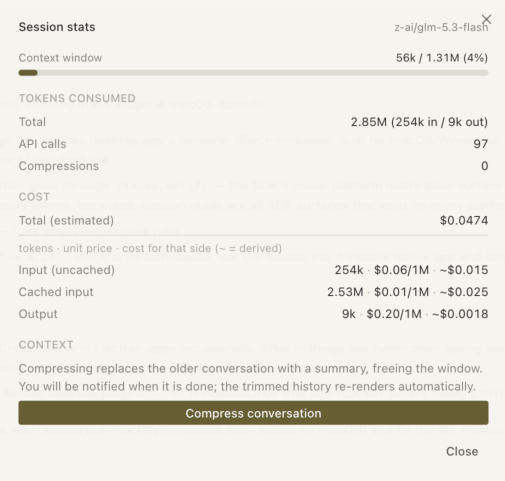

# Hermes Session Costs

Per-session token usage, **cost in USD**, and a **context-window meter** in the
Hermes desktop status bar — plus a one-click **Compress conversation** button.

Hermes shows project-level spend, but nothing told you what *this* conversation
has cost so far, or how close it is to filling its context window. This plugin
puts both in the status bar, Cline-style, and lets you compress without leaving
the panel.

```
107k tok · 33k/200k (16%) · $0.03
```

The details panel (click the chip) — context bar, token split, cost with a
per-side breakdown, and one-click compression:



## Install

**One-click (install link):**

<a href="hermes://plugin/install?repo=tomRumi/hermes-session-costs&enable=1">Install in Hermes</a>

```html
<a href="hermes://plugin/install?repo=tomRumi/hermes-session-costs&enable=1">Install in Hermes</a>
```

Hermes shows a confirmation dialog naming the repo and what it ships before
anything is installed — deep links never auto-install.

**Or from the CLI:**

```bash
hermes plugins install tomRumi/hermes-session-costs
```

Then enable the desktop half in **Settings → Plugins** (it ships opt-in, like
every desktop half of a unified package).

### Upgrading from the standalone copy

If you previously ran this as a standalone desktop plugin at
`~/.hermes/desktop-plugins/session-stats/`, **delete that folder** before
enabling this package — otherwise two plugins both register a status-bar chip
and you get two chips.

```bash
rm -rf ~/.hermes/desktop-plugins/session-stats
```

## What it does

For the session you are looking at (it follows whichever chat or tile has
focus):

- **Ribbon chip** — cumulative tokens consumed, context window used/total with
  a percentage, and the session's cost in USD.
- **Colour cues** — the chip turns amber at 85% of the context window and red
  at 92%, as a "consider compressing" signal.
- **Details panel** (click the chip) — context bar with used/max and the model,
  tokens in/out/total, API call count, compression count, the aggregate cost,
  and a per-side cost breakdown.
- **Per-side cost breakdown** — `Input (uncached)`, `Cached input`, and
  `Output`, each as `tokens · unit price per 1M · cost for that side`.
- **Compress conversation** — runs the same backend compression the built-in
  `/compress` command uses.
- **Completion notification** — if compression outlives the request window and
  finishes in the background, you get a toast (plus an OS notification if the
  app is in the background) so you know you can carry on.

## What it does NOT do

Being precise here matters more than sounding impressive:

- **It does not fetch prices.** Cost figures are computed by Hermes itself and
  merely displayed by the plugin. Unit prices come from Hermes' own model
  catalog (the same numbers the model picker shows).
- **No live unit prices for every provider.** Hermes retrieves live pricing only
  for providers that publish it (Nous, OpenRouter, Vercel AI Gateway, Novita,
  DeepInfra, Fireworks). For others — Anthropic direct, OpenAI direct, local
  Ollama, custom endpoints — the panel shows `—` rather than inventing a rate.
- **Cost is usually an estimate.** Until a provider reports billed amounts,
  Hermes records an *estimated* cost from its pricing table. The panel labels
  which one it is. Per-side costs are derived from the displayed (rounded) rate
  and are marked `~`; the aggregate total is the authoritative figure.
- **USD only.** No currency conversion.
- **Sessions driven outside the app show less.** A session run by an external
  process (for example `hermes chat --oneshot` from an orchestration script) has
  no live runtime inside the app, so the chip falls back to the session's stored
  row: tokens and cost, with the context window shown as `—`.
- **Compression needs a running session.** The Compress button is disabled for a
  session that is not live in the app, because compression is a backend
  operation on a live session.
- **Only the focused session.** There is no all-sessions table.
- **Desktop app only.** Nothing appears in the CLI or TUI.
- **No themes, tools, or agent-side behaviour.** It is a UI plugin.

## Requirements

- Hermes Agent desktop app, `>= 0.21`
- The desktop half must be enabled in Settings → Plugins

## Documentation

The wiki covers the internals: how the chip resolves data per session, where
each number comes from, why some values are estimates, and how compression is
triggered.

- [How it works](https://github.com/tomRumi/hermes-session-costs/wiki/How-it-works)
- [What it does and does not do](https://github.com/tomRumi/hermes-session-costs/wiki/What-it-does-and-does-not-do)
- [Install and upgrade](https://github.com/tomRumi/hermes-session-costs/wiki/Install-and-upgrade)
- [Troubleshooting](https://github.com/tomRumi/hermes-session-costs/wiki/Troubleshooting)

## License

MIT — see [LICENSE](LICENSE).
